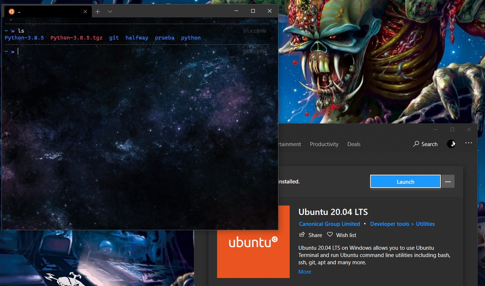
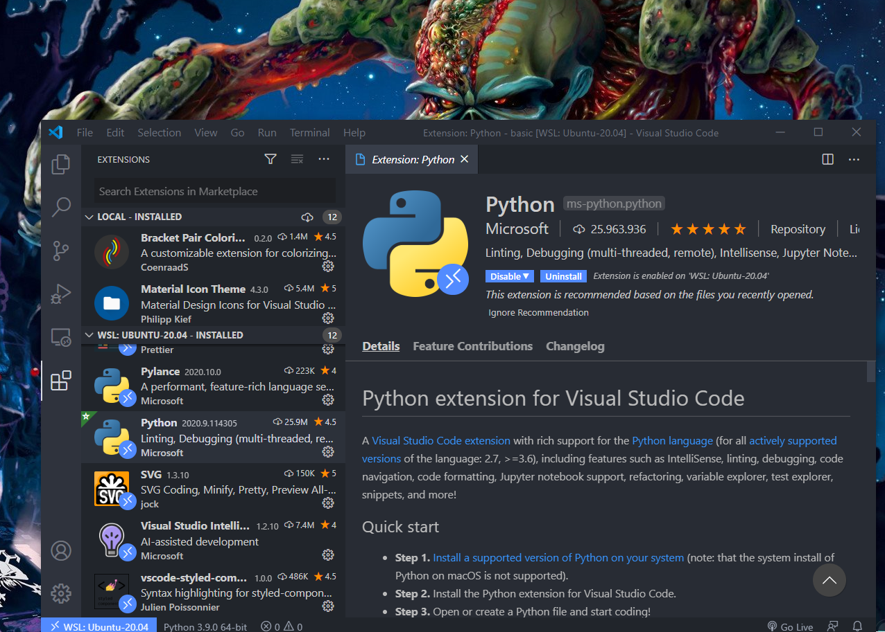
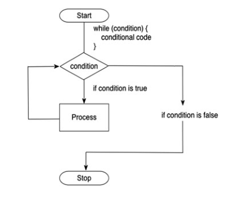
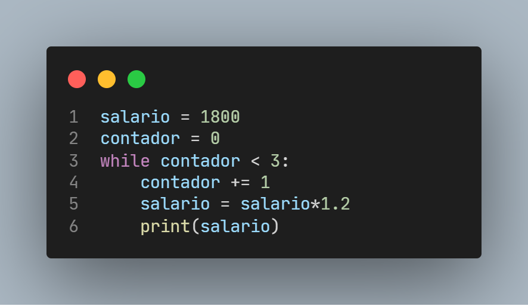
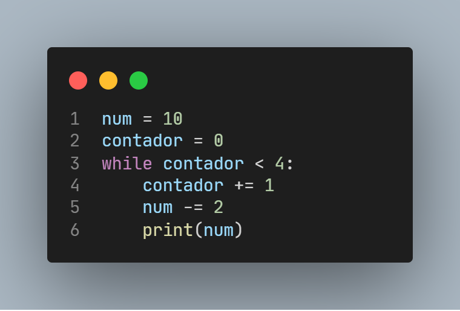

# Lenguaje Python

Python es un potente lenguaje de programación y fácil de aprender. Tiene estructuras de datos eficientes de alto nivel y un enfoque simple pero efectivo para la programación orientada a objetos. Su elegante sintaxis escritura dinámica, junto con su naturaleza **interpretada**, lo convierten en un lenguaje ideal para la creación de scripts y el rápido desarrollo de aplicaciones en muchas áreas en la mayoría de las plataformas.

## 1. Introducción

- Es un lenguaje de programación interpretado.
- Hace énfasis a una sintaxis de código legible.
- Su tipado es dinámico y fuerte.
- Soporta POO: Programación Orientado a Objetos
- Creado por Guido Van Rossum científico en computación
- Es administrado por Python Software Foundation.
- Posee una licencia de código abierto.
- Buenas y bien documentadas bibliotecas para la computación científica.
- Lenguaje que permite escribir código legible y bien estructurado.
- Posee muchos módulos complementarios

## 2. Entorno de desarrollo

Personalmente uso [WSL2](https://docs.microsoft.com/en-us/windows/wsl/install-win10) (Windows Subsystem for Linux) con la distro [Ubuntu 20.04](https://ubuntu.com/blog/ubuntu-on-wsl-2-is-generally-available) y con el editor de codigo Visual Studio Code. La versión que utilizare para estos codenotes sera la 3.9.0 .





<!-- 
### Problemas Propuestos de Estructuras Condicionales

1. Estructura secuencial : tarea 3 ejercicios
2. Estructura condicional

- simple
- doble
- multiple

---

1 Crear un algoritmo en python que permita leer un numero de 3 cifras y si el numero es diferente a 3 cifras que muestre un mensaje de advertencia, el algoritmo debera devolver la suma de los digitos ingresados.

2 Un cliente decide comprar uno o varios articulos pero desea que se le otorgue un descuento, el lugar de compra es el centro comercial gamarra guizado que tiene 6 pisos los descuentos estan en funcion a la siguiente tabla

| Pisos | Descuento |
| ----- | --------- |
| 1     | 2%        |
| 2 - 4 | 3%        |
| 5 - 6 | 5%        |

Calcular el Precio Final que debera de pagar el cliente.

---

3. Iteration/Looping

While Loop
Se usa para iterar (o repetir) una o más declaraciones de código siempre que la condición de prueba (expresión) sea werdadera.



Ejemplo:
Un programador tiene un salario inicial de \$ 1800, y recibe un incremento de 20 % anual durante 3 años. ¿Qué salario ha recibido en cada uno de los 3 años?



```
2160.0
2592.0
3110.4
```

Utilizando while crear un algoritmo que visualice la lista de los numeros naturales del 2 al 8 en forma descendente.

 -->

