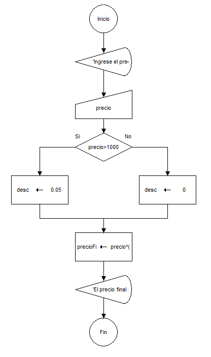
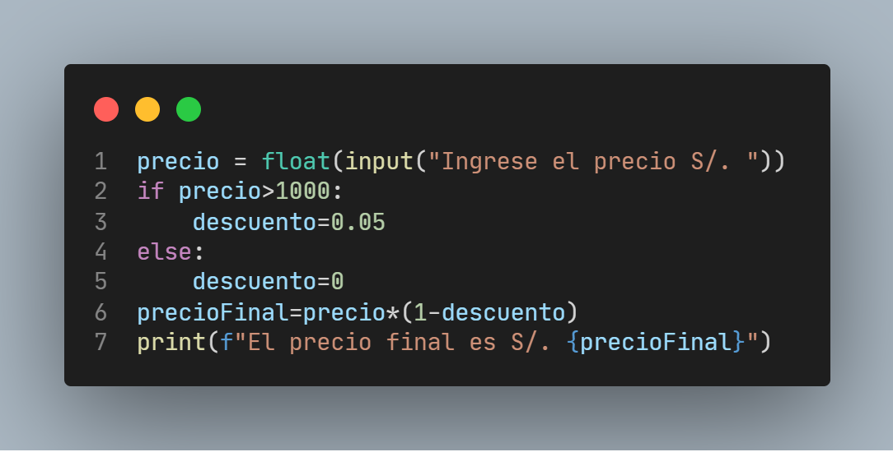
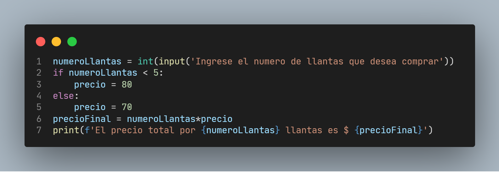

# Estructura de Programacion

1. Estructura secuenciales
2. Estructura condicionales
3. Estructura Repetitivas

Ejemplo
a. Crear un algoritmo en Dfd que permita leer el precio de un producto, calcular el precio final tomando en cuenta que si el precio es superior a 1000 soles,tendra un descuento del 5% de lo contrario su descuento sera cero.

b. Condicional multiple. Si gasto hasta S/. 100, pago en efectivo. Si gasto mas de S/.100 pero menos de S/.300, pago con tarjeta de debito. Y para compras de S/.300 a maso pago con tarjeta de credito.

c. Calcular el total que una persona debe pagar en una llanteria, si el precio de cada llanta es de $80 si se compra menos de 5 llantas y de $70 si se compran 5 a mas.

